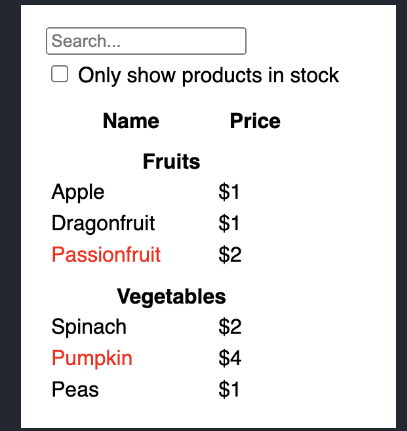
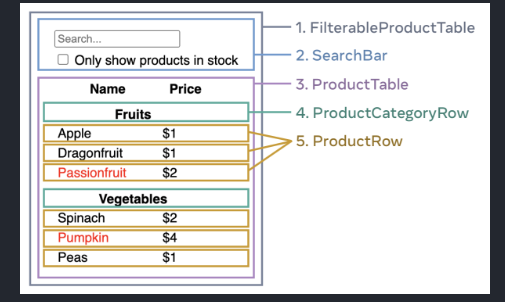

# Thinking in React

Imagine that you already have a JSON API and a mockup from a designer.  

The JSON API returns some data that looks like this:

<pre>
[
  { category: "Fruits", price: "$1", stocked: true, name: "Apple" },
  { category: "Fruits", price: "$1", stocked: true, name: "Dragonfruit" },
  { category: "Fruits", price: "$2", stocked: false, name: "Passionfruit" },
  { category: "Vegetables", price: "$2", stocked: true, name: "Spinach" },
  { category: "Vegetables", price: "$4", stocked: false, name: "Pumpkin" },
  { category: "Vegetables", price: "$1", stocked: true, name: "Peas" }
]
 </pre>

 ## The Mock-up look like this:-

 

 Separate your UI into components, where each component matches one piece of your data model.

There are five components on this screen:

1) FilterableProductTable (grey) contains the entire app.
2) SearchBar (blue) receives the user input.
3) ProductTable (lavender) displays and filters the list according to the user input.
4) ProductCategoryRow (green) displays a heading for each category.
5) ProductRow (yellow) displays a row for each product.